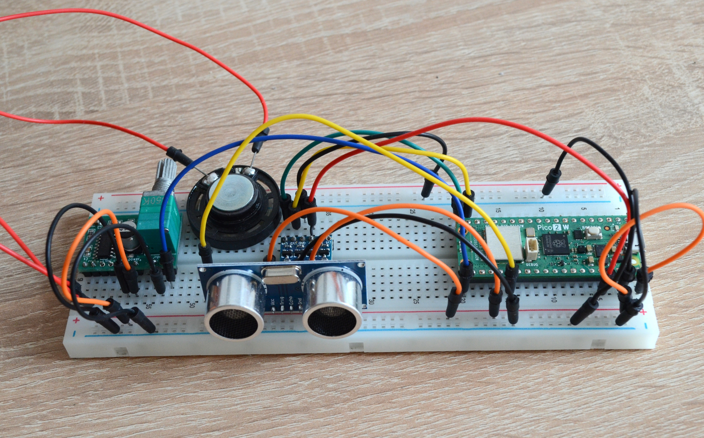

# AlarmPico

This is the source code for my first real hardware project ever, an alarm device built with a Raspberry Pi Pico 2 W. It is designed to detect movement with an ultrasonic sensor and play an alarm beep if movement is detected. I might add support for messaging via WLAN in the future when an alarm is triggered. The source is built with the Raspberry Pi Pico extension and C SDK.

